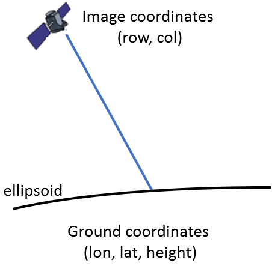
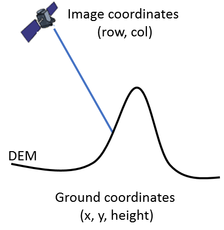

.. Shareloc documentation master file, created by
   sphinx-quickstart on Wed Sep  9 14:17:17 2020.
   You can adapt this file completely to your liking, but it should at least
   contain the root `toctree` directive.

:Version: |version|

Shareloc, a simple remote sensing geometric library
===================================================

**Shareloc** is an open source remote sensing geolocation library.

+-------------------------------------------+----------------------------+
| Direct localization at constant elevation | Direct localization on DEM |
+-------------------------------------------+----------------------------+
| |img1|                                    | |img2|                     |
+-------------------------------------------+----------------------------+

Shareloc performs :ref:`user_manual_functions` between sensor and ground and vice versa: 

- Direct/inverse localization at constant elevation (ellipsoidal earth model).
- Direct localization on 2.5D DEM (w.r.t ellipsoid or geoid).
- Line of sight triangulation.
- Rectification grid creation.
- Rectification grid interpolation.

Shareloc handles RPC and direct location grids :ref:`user_manual_geometric_models`.

Why Shareloc ?
--------------

Shareloc development has been motivated by the need of a full python component for CNES studies and the need of an underlying geometrical component for CARS. 

Be aware that the project is new and is evolving to maturity with your help. 

**Contact:** cars AT cnes.fr

.. toctree::
   :maxdepth: 2

   getting_started
   install
   user_manual
   developer
   api_reference/index.rst
   glossary
   faq

