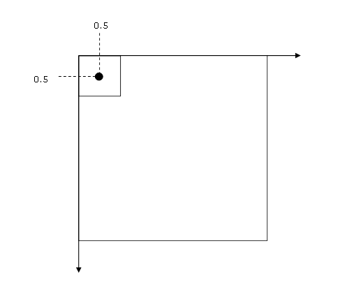

.. _user_manual_conventions:

===========
Conventions
===========

This sections details Shareloc conventions for images and geometric models.

Pixel convention
================

Geometric model convention for coordinates is, by default, [0.5,0.5] at the center of the first pixel of the image, as illustrated below.

    pixel convention

Image convention
================

In Shareloc image convention, ``index`` refers to the position in the 2D array and ``Physical point`` the position of the pixel.

The transformation between ``index`` and ``Physical point`` use the geotransform of the image. `OTB Software guide chapter 5.1`_ gives complete descriptions of these concepts.

Shareloc Image class (``shareloc.image.Image``) manages the conversion between index and physical point.

:term:`ROI` can be easily managed without any processing on geometric model. See `CARS Faq <https://cars.readthedocs.io/en/latest/faq.html#faq>`_ or `GDAL translate command <https://gdal.org/programs/gdal_translate.html>`_ to create image extraction.

See `image example in test directory <https://github.com/CNES/shareloc/tests/test_image.py>`_ for more details.

.. _`OTB Software guide chapter 5.1`: https://www.orfeo-toolbox.org/packages/archives/Doc/SoftwareGuide-6.6.0.pdf
