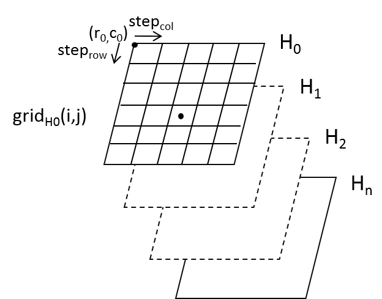

.. _user_manual_geometric_models:

================
Geometric models
================

Shareloc handles two type of geometric models: :ref:`RPC` and :ref:`Direct location grids`.

RPC
===

:term:`RPC` is an analytic function for ground (lon,lat,h) to image (r,c) mapping.

It can be summarized as:

:math:`(r,c) = (f(P,L,H),g(P,L,H))`

where:

- :math:`f()`, :math:`g()` are Rational Polynomial Function
- and :math:`(P,L,H)` normalized ground positions.

The Rational Function Polynomial equation numerators and denominators are 20-term cubic polynomial functions, which respects RPC00B convention.
This relationship between ground and image is called inverse RPC coefficients.
Only inverse coefficients are compulsory, if direct ones are not available then direct localization is computed by iterating on inverse one
 
Direct mapping, if available  can be summarized as:

:math:`(lon,lat) = (h(R,C,H),i(R,C,H))`

where:

- :math:`h()`, :math:`i()` are Rational Polynomial Function
- and :math:`(R,C,H)` normalized image coordinates (R,C) and normalized altitude H.

Further details are given in `RPC in Geotiff`_, `STDI-0002 2.1 (16Nov2000) specification document`_ and `Pléiades user guide Appendix C.3`_.

Supported RPC formats
---------------------

* DIMAP format (V1/V2/V3)
* OSSIM keywordlist
* Geotiff RPC
* All gdal supported format containing rpc (https://gdal.org/drivers/raster/index.html)

RPC class API Example
----------------------

.. code-block:: console

    $ wget https://raw.githubusercontent.com/CNES/shareloc/tests/data/rpc/RPC_PHR1B_P_201709281038393_SEN_PRG_FC_178609-001.XML
    $ python3
    >>> from shareloc.geomodels import GeoModel
    >>> file_dimap = "RPC_PHR1B_P_201709281038393_SEN_PRG_FC_178609-001.XML")
    >>> rpc_dimap = GeoModel(file_dimap,  geomodel_type = "RPC")

Note : there is a C++ version of RPC geometric model (see :ref:`developer`.), which can be used by setting ``geomodel_type = "RPCoptim"``.
this geometric model is under development in current *Shareloc* version |version|.

Direct location grids
=====================

Direct location grid is a sampled geometric model, which contains direct location at each grid cell for H0 to Hn altitude layers.

It can be viewed at 3D grid (row,col,h) as illustrated below :

    direct location grid

.. note::
    Within the grid a bilinear interpolation is used between the grid nodes.
    If a point location outside the grid is requested, shareloc computes an extrapolation that is equivalent
    to scipy.interpolation.interpn() function.

Shareloc grid format specifications
-----------------------------------

Shareloc grid must be a geotiff image, which contains 2 bands per altitude layer. One corresponding to x or longitude coordinates, the other corresponding to y or latitude coordinates.

Following metadata are needed:

*  ALTITUDE_BX=Y : one per band X with altitude value Y
*  REF=EPSG:XXXX : coordinate reference system of ground coordinates

.. note::
    The shareloc grid conventions line up with the Libgeo conventions.

Shareloc grid format example
----------------------------

The example is composed of 9x5 grid composed of 3 altitude layers (-30m,485m,1000m). Each cell contains direct location at altitude layer of image position calculated from its geotransform.

In the example below:

- ``my_multi_h_grid`` is a 9x5x6 grid.
- ``my_multi_h_grid`` contains at index :math:`(row, col)` direct location of :math:`(row  * steprow + row0,  col * stepcol + col0)`, for example with `(band, row, col)` convention :math:`my\_multi\_h\_grid[0:1,1,2] = direct\_loc(row = 1250,col = 625,h = -30)`

.. code-block:: console

    $ gdalinfo my_multi_h_grid.tif

.. code-block:: console

    Driver: GTiff/GeoTIFF
    Files: test2.tif
    Size is 9, 5
    Coordinate System is `'
    Origin = (-312.500000000000000,-625.000000000000000)
    Pixel Size = (625.000000000000000,1250.000000000000000)
    Metadata:
      ALTITUDE_B0=-30.0
      ALTITUDE_B1=-30.0
      ALTITUDE_B2=485.0
      ALTITUDE_B3=485.0
      ALTITUDE_B4=1000.0
      ALTITUDE_B5=1000.0
      REF=EPSG:4326
    Image Structure Metadata:
      INTERLEAVE=PIXEL
    Corner Coordinates:
    Upper Left  (    -312.500,    -625.000)
    Lower Left  (    -312.500,    5625.000)
    Upper Right (    5312.500,    -625.000)
    Lower Right (    5312.500,    5625.000)
    Center      (    2500.000,    2500.000)
    Band 1 Block=9x5 Type=Float64, ColorInterp=Gray
    Band 2 Block=9x5 Type=Float64, ColorInterp=Undefined
    Band 3 Block=9x5 Type=Float64, ColorInterp=Undefined
    Band 4 Block=9x5 Type=Float64, ColorInterp=Undefined
    Band 5 Block=9x5 Type=Float64, ColorInterp=Undefined
    Band 6 Block=9x5 Type=Float64, ColorInterp=Undefined

Grid API Example
----------------

.. code-block:: console
    
    $ wget https://raw.githubusercontent.com/CNES/shareloc/tests/data/ellipsoide/loc_direct_grid_PHR_2013072139303958CP.tif
    $ python3
    >>> from shareloc.geomodels import GeoModel
    >>> geotiff_grid_path = "loc_direct_grid_PHR_2013072139303958CP.tif"
    >>> geotiff_grid = GeoModel(geotiff_grid_path, "GRID")

References
__________

- `RPC in Geotiff`_
- `STDI-0002 2.1 (16Nov2000) specification document`_
- `Pléiades user guide Appendix C.3`_

.. _`RPC in Geotiff`: http://geotiff.maptools.org/rpc_prop.html
.. _`STDI-0002 2.1 (16Nov2000) specification document`: http://geotiff.maptools.org/STDI-0002_v2.1.pdf
.. _`Pléiades user guide Appendix C.3`: https://content.satimagingcorp.com/media/pdf/User_Guide_Pleiades.pdf`
